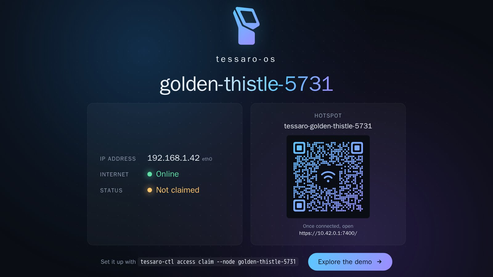
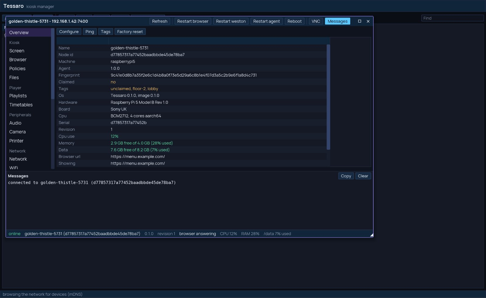
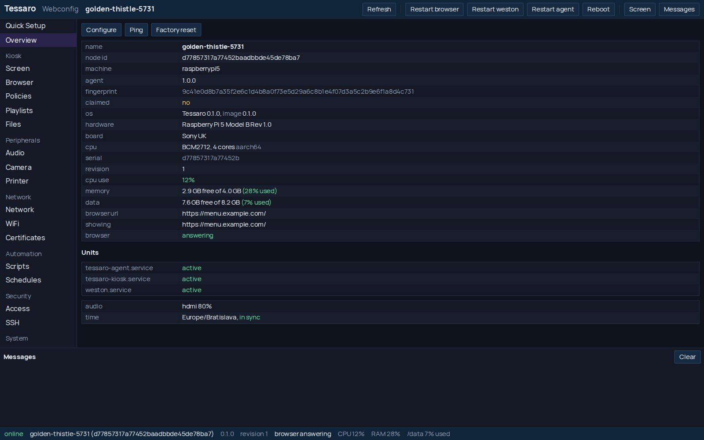
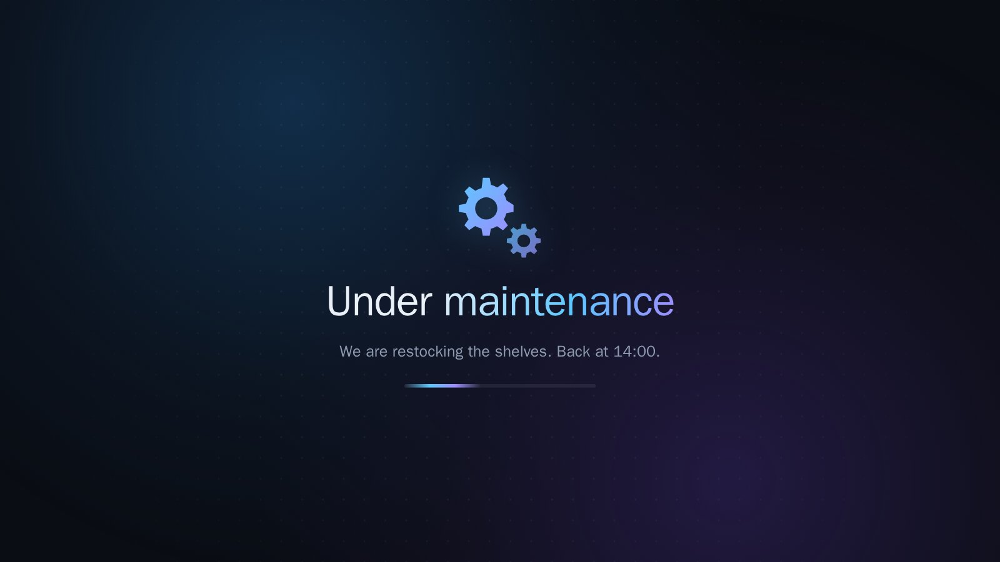
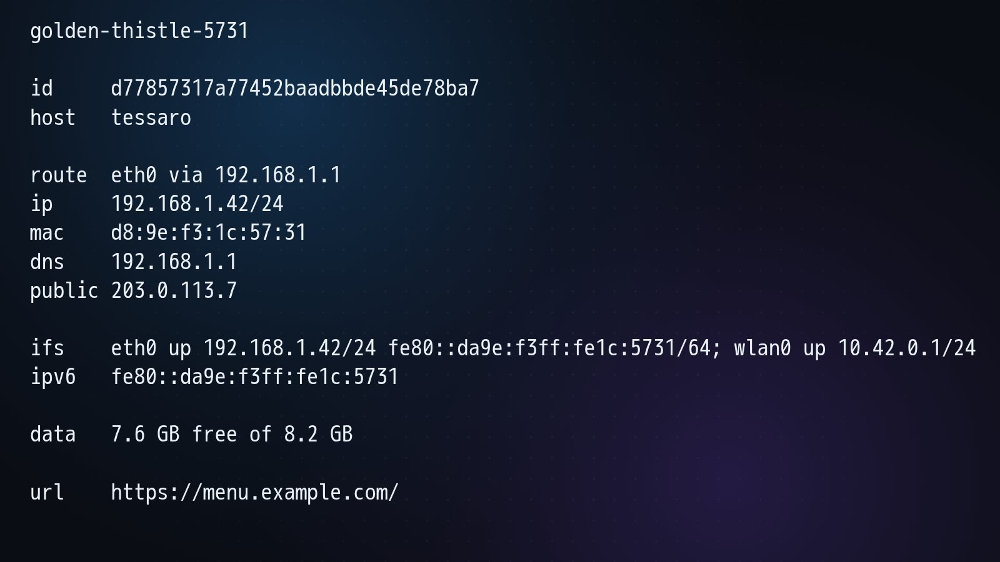
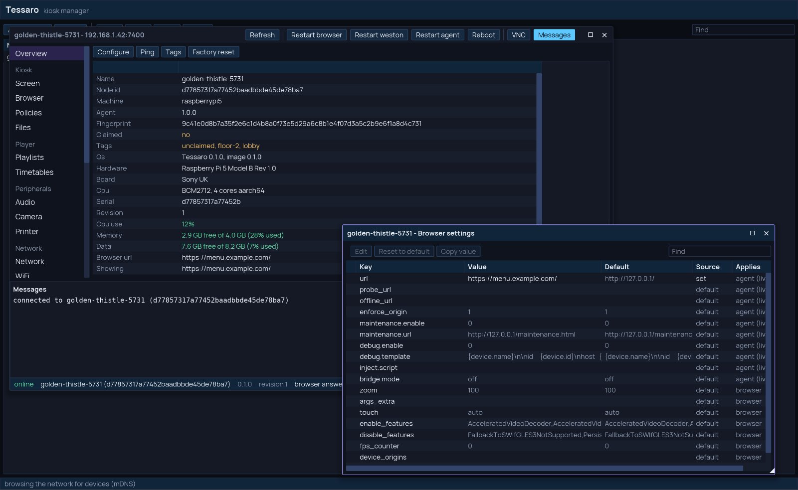
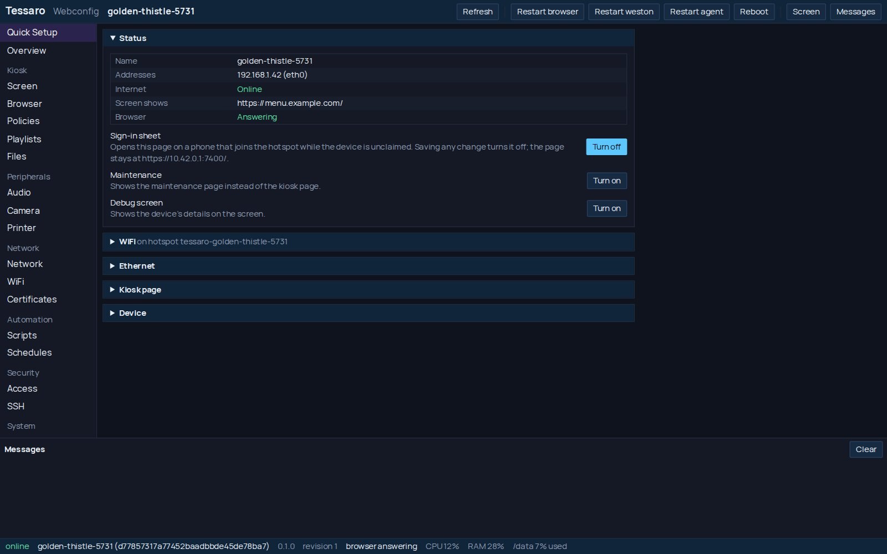

<p align="center">
  
</p>

<h1 align="center">tessaro-os</h1>

<p align="center">
  <strong>The kiosk and signage screen that looks after itself.</strong><br>
  Turn a Raspberry Pi or an x86 PC into a locked-down kiosk or digital signage
  screen that boots straight into your web app, keeps it running, and is managed
  from anywhere.
</p>

<p align="center">
  <a href="#try-it-on-a-mac">Try it on a Mac</a> ·
  <a href="#features">Features</a> ·
  <a href="#peripherals-straight-from-the-page">Peripherals</a> ·
  <a href="#complete-chromium-policy-management">Policies</a> ·
  <a href="#tested-hardware">Hardware</a> ·
  <a href="#pre-built-images">Images</a> ·
  <a href="#quick-start">Quick start</a>
</p>



> **No screen at hand? Try Tessaro on your Mac first.** Download **Try
> Tessaro** from [Releases](https://github.com/alhafoudh/tessaro-os/releases),
> drag it to Applications and press Start: a whole Tessaro device runs in a
> window, with the desktop app, a terminal and Webconfig one click away.
> [How →](#try-it-on-a-mac)

Every screen you deploy is a promise: the menu is up, the departure board is
current, the check-in works, the dashboard is live. Tessaro keeps that promise without anyone standing next to
it. Flash it, plug it in, point it at your site:

```sh
tessaro-ctl -n golden-thistle-5731 config set browser.url=https://menu.example.com/
```

That is the whole deployment. Tessaro is not a CMS: point it at your signage
player's web URL or at any page of your own.

Prefer windows to a terminal? Manage it from [the desktop app](#the-desktop-app),
or from [Webconfig](#webconfig) in any browser:

<p align="center">
  <a href="#the-desktop-app"></a>
  <a href="#webconfig"></a>
</p>

## Features

### For integrators and admins

- 🔁 **Self-healing page**: crashed tabs reload, a stuck browser restarts, an offline page covers outages, a watchdog guards the guard.
- 🔒 **Locked to your site**: wander off your origin and the screen comes straight back.
- 🛡️ **Unbreakable by design**: read-only system, your data on its own partition, factory reset in one command.
- 💾 **Durable state**: settings, owners, policies and printers live in SQLite stores built to survive the power cut.
- 📦 **Updates over the network** that keep every setting, verify every block and survive a power loss mid-write.
- 🌐 **Network changes you cannot get wrong**: a new address or WiFi that loses the network rolls itself back.
- 🔑 **Secure from the first boot**: claim it and it is yours, with TLS, pinned certificates, tokens and a random root password.
- 🖥️ **Manage it your way**: a scriptable CLI, a desktop app, or Webconfig in any browser, with Quick Setup from a phone.
- 🏢 **Enterprise networks welcome**: HTTP and SOCKS proxies, your own certificate authorities, your own NTP servers.
- ⏰ **Scripts and schedules**: screens off at night, a different page at the weekend, anything a shell can do.
- 🧰 **Maintenance and debug screens** at the flip of a switch, with your own message.
- 👀 **See and reach it remotely**: a live VNC view of the panel you can click and type in (or only watch), and an SSH shell with your own key.
- 📺 **Display safety net**: a new resolution nobody confirms reverts by itself.
- ⚡ **Changes apply live**: most settings take effect without a restart, and nothing restarts that does not have to.

### For digital signage

- 📅 **Screens on a schedule**: panels off at night, a different page at the weekend.
- 📁 **Content that plays offline**: sync videos, images and JSON to the device, served at `http://127.0.0.1/files/`, and they keep playing when the network drops.
- 🧩 **One image, a whole fleet**: `{placeholders}` and your own `data.*` keys give each screen its own playlist URL.
- 📸 **See what every screen shows**: a screenshot or a live VNC view, from anywhere.
- 🔊 **Sound and screen power, managed remotely.**

### For developers

- 🔓 **Locked down, never locked in**: full root access stays yours. Tessaro's services orchestrate standard systemd units and plain config files, so you can extend the system with your own services the usual Linux way.
- 🌉 **A bridge into the device**: an injected script and `window.tessaro` let your page read status, print and run scripts.
- 📜 **A real HTTP API**, with an OpenAPI document and Swagger UI on the device.
- 🐞 **Remote DevTools** and `browser eval`, for debugging the page as the screen runs it.
- ⚙️ **Chromium your way**: extra flags, features and enterprise policies per device, no rebuild.
- 📖 **Self-documenting settings**: every key says what it accepts, its default and what a change restarts.

## Peripherals, straight from the page

Your web app talks to real hardware, on a screen nobody is standing at, with no
permission prompt in the way.

- 🔌 **WebSerial** and 🎮 **WebHID**, pre-granted to your site: scales, scanners, payment terminals, controllers.
- 🧷 **WebUSB**, granted per device by vendor and product id.
- 📶 **Web Bluetooth**, opt-in: one pairing by a technician and it stays.
- 🎙️ **Microphone** granted to your site, with the input and level set remotely.
- 📷 **USB cameras, shared**: your page and other software on the device watch the same camera at once.
- 🖨️ **Printing**: `window.print()` goes silently to the default printer, and the bridge prints to any printer by name. Office printers need no driver (IPP Everywhere, AirPrint), and receipt and label printers take raw ESC/POS or ZPL. Find printers on USB and the network and set them up from the CLI, the desktop app or Webconfig.
- 👆 **Touch screens** work out of the box.
- ⌨️ **On-screen keyboard** that appears only when no keyboard is plugged in.
- 🔊 **Sound** on HDMI, the headphone jack or USB, switched and leveled remotely.

The details, and what your page needs to do, are in
[docs/kiosk-browser.md](docs/kiosk-browser.md#device-apis-webserial-webhid-webusb-web-bluetooth),
[docs/printing.md](docs/printing.md) and [docs/camera.md](docs/camera.md).

## Complete Chromium policy management

Chromium's enterprise policies are the most powerful way to shape a browser,
and Tessaro puts all of them in your hands.

- 🔐 **Locked down out of the box**: nothing pops over your page, no sign-in, no sync, no background traffic.
- 🚧 **Only the sites you allow**, with two settings: `tessaro-ctl config set browser.block='*' browser.allow=menu.example.com`. The device's own pages always stay reachable.
- 🔄 **Kept in step for you**: device grants, proxy and certificates follow your settings, with no hand-editing.
- 📚 **Any [Chromium policy](https://chromeenterprise.google/policies/) you need**, as named documents with comments, in a clear priority order.
- ✅ **Checked before they land**: a typo or a conflict with what the device manages is refused, with the line.
- 🔍 **One merged view** of exactly what Chromium reads, and where each policy came from.
- 🖱️ **Edited where you work**: the CLI, the desktop app or Webconfig, with Move up and Move down.

```jsonc
// kiosk.json: comments and trailing commas are fine
{
  "DownloadRestrictions": 3, // no downloads
  "AutoplayAllowed": true,   // videos start with sound
  "TranslateEnabled": false,
}
```

```sh
tessaro-ctl browser policies set kiosk kiosk.json   # or `edit kiosk` in $EDITOR
tessaro-ctl browser policies show                    # what Chromium reads, and from where
tessaro-ctl browser policies move kiosk 1            # the top one wins
```

The browser restarts only when the merged result actually changes. More in
[docs/kiosk-browser.md](docs/kiosk-browser.md#policies).

## Tested hardware

| Platform | Hardware | Machine | Status |
| --- | --- | --- | --- |
| x86_64 | Dell OptiPlex 7050 | `genericx86-64` | ✅ tested |
| x86_64 | Radxa X4 (Intel N100) | `genericx86-64` | ⏳ testing pending |
| x86_64 | Radxa X5 (Intel N150) | `genericx86-64` | ⏳ testing pending |
| arm64 | Raspberry Pi 3 Model B+ | `raspberrypi3-64` | ✅ tested |
| arm64 | Raspberry Pi 4 (SD or USB) | `raspberrypi4-64` | ⏳ testing pending |
| arm64 | Raspberry Pi 5 (SD, USB or NVMe) | `raspberrypi5` | ✅ tested |
| x86_64 | Other UEFI PCs and mini PCs | `genericx86-64` | 🧪 more to come, community testing appreciated |
| arm64 | Apple silicon Mac, in a VM | `genericarm64` | ✅ [try it on a Mac](#try-it-on-a-mac) |
| x86_64 | QEMU | `qemux86-64` | 🛠️ development and end-to-end tests |

Every machine runs the same software. On the Pi 3, plan around its 1 GB of
memory, shared with the GPU. Tried Tessaro on other hardware? Open an issue
and tell us how it went.

## Pre-built images

Chromium alone takes hours to compile. You do not have to: ready-to-flash
images for every machine are published on
**[GitHub Releases](https://github.com/alhafoudh/tessaro-os/releases)**.

They are built by GitHub Actions on a **self-hosted runner** on a beefy build
machine, which keeps the whole Yocto download and build cache warm between
builds and has room for builds that run for hours. The same pipeline boots
the qemu image and runs the end-to-end suite against it. How it all works is
in [docs/ci.md](docs/ci.md).

Every release also carries `tessaro-ctl` and `tessaro-gui` for Linux
(x86_64, aarch64), macOS (Apple silicon) and Windows. The macOS ones are not
notarized: clear the quarantine flag once with `xattr -dr
com.apple.quarantine Tessaro.app tessaro-ctl`.

```sh
bmaptool copy tessaro-os-raspberrypi5-<version>.wic.zst /dev/sdX   # first install
tessaro-ctl update send tessaro-os-raspberrypi5-<version>.wic.zst  # every update after that, over the network
```

## Try it on a Mac

No spare screen at hand? An Apple silicon Mac runs a whole Tessaro device in
a virtual machine, with nothing to install or set up. The VM has no GPU, so
pages render in software and run slower than on a real device:

1. **Download** `try-tessaro-<version>-macos-arm64.dmg` from
   [Releases](https://github.com/alhafoudh/tessaro-os/releases).
2. **Drag** Try Tessaro to Applications. It is signed ad hoc, not
   notarized, so clear its quarantine flag once:

   ```sh
   xattr -dr com.apple.quarantine "/Applications/Try Tessaro.app"
   ```

3. **Open it and press Start.**

The kiosk opens in a window of its own. Try Tessaro's window opens
`tessaro-gui`, a terminal with `tessaro-ctl` ready and Webconfig, and its
Try it tab has things to do on the device, each with the `tessaro-ctl`
command that does the same. The device keeps its settings between launches
until Reset to factory, and is reachable from this Mac only, at
`127.0.0.1:7401`. How it works is in
[docs/try-tessaro.md](docs/try-tessaro.md).

**For developers**, the same image also boots from a checkout with
Homebrew's QEMU, with the device on the Mac's own network, where
`tessaro-ctl`, `tessaro-gui` and Webconfig find it like any other:

```sh
brew install qemu zstd mise
git clone https://github.com/alhafoudh/tessaro-os.git && cd tessaro-os
mise trust
export MISE_AUTO_INSTALL=false   # booting needs none of the build toolchains
mise run qemu:run:arm64 ~/Downloads/tessaro-os-genericarm64-<version>.wic.zst
```

The image is `genericarm64` from
[Releases](https://github.com/alhafoudh/tessaro-os/releases), next to the
macOS `tessaro-ctl` and `Tessaro.app`. It asks for your password once,
because macOS's VM networking needs root; `--no-vmnet` runs without it, with
the device on `127.0.0.1:7401` instead. Then carry on with the
[quick start](#quick-start) from step 2. The VM starts fresh on every boot,
so a claim and settings last until you close it.

## Quick start

1. **Flash** an image to an SD card, USB stick or disk and boot it with a
   network cable in. The welcome page shows the device's name and address.
2. **Get the client** and find the device:

   ```sh
   mise run ctl:build            # or the tessaro-ctl from a release
   tessaro-ctl nodes list        # devices answering on this network
   ```

3. **Claim it.** You get a token and its root password, shown once:

   ```sh
   tessaro-ctl -n golden-thistle-5731 access claim
   ```

4. **Point it at your site**:

   ```sh
   tessaro-ctl -n golden-thistle-5731 config set browser.url=https://menu.example.com/
   ```

No laptop at hand? Join the device's hotspot with a phone, scan the QR code on
screen, and Quick Setup opens by itself.

The start of its name is enough (`-n golden`), as long as no other device you
know or that answers on the network starts the same way.

Set `TESSARO_NODE=golden-thistle-5731` and the `-n` can go; the tour below
leaves it out.

## A quick tour

**See what a device is doing**

```
$ tessaro-ctl device status
name         golden-thistle-5731
machine      raspberrypi5
claimed      yes
browser url  https://menu.example.com/
showing      https://menu.example.com/
browser      answering
audio        hdmi 80%
time         Europe/Bratislava, in sync
```

**One image, a different page per screen**

```sh
tessaro-ctl config set 'browser.url=https://menu.example.com/?table={data.table}' data.table=12
tessaro-ctl config set 'browser.url=https://{device.name}.signage.example.com/'
```

**Maintenance and debug screens**

```sh
tessaro-ctl config set 'data.msg=We are restocking the shelves. Back at 14:00.' \
  'browser.maintenance.url=http://127.0.0.1/maintenance.html?message={data.msg}'
tessaro-ctl browser maintenance on
tessaro-ctl browser debug on      # name and addresses in large type, for the technician
```

<p align="center">
  
  
</p>

**Offline files**

```sh
tessaro-ctl files sync ./site-assets      # like rsync, resumable; served at http://127.0.0.1/files/
```

**Printers**

```sh
tessaro-ctl printer discover
tessaro-ctl printer create office --uri ipp://10.0.0.5/ipp/print
tessaro-ctl printer create receipt --raw --uri socket://10.0.0.9:9100
tessaro-ctl config set printer.enable=1   # window.print() now prints, silently
```

**Screen, network and time**

```sh
tessaro-ctl config set screen.resolution=1920x1080 && tessaro-ctl screen confirm
tessaro-ctl network wifi join Office
tessaro-ctl network proxy set 'http://proxy.corp.test:8080' --bypass .corp.test
tessaro-ctl time timezone Europe/Bratislava
```

**Scripts and schedules**

```sh
tessaro-ctl script create screen-off --body 'tessaro-ctl screen power off'
tessaro-ctl schedule create screen-off --on 'Mon..Fri 20:00' --script screen-off
```

**Updates and access**

```sh
tessaro-ctl update send tessaro-os-raspberrypi5-<version>.wic.zst
tessaro-ctl ssh connect                   # root shell with your own SSH key
tessaro-ctl access token create phone     # a token for a second client
```

Every command group has worked examples in `tessaro-ctl <group> --help`, and
`tessaro-ctl config keys` documents every setting.

### The desktop app

`tessaro-gui` is everything the CLI does, in windows and tables: every device
on the network in one list, a page per area, a file manager, printers,
policies, a live journal, and a live VNC view of the screen to control it
from. It shares the
CLI's devices and tokens, so a device claimed in one is open in the other.

<p align="center">
  
  
</p>

### Webconfig

Every device serves its own management pages at `https://<device>:7400/`.
Quick Setup gets a fresh device online from a phone, and the rest covers what
the desktop app does, from any browser. `tessaro-ctl access webconfig` opens
it signed in.

<p align="center">
  
  
</p>

## Build it yourself

```sh
git clone git@github.com:alhafoudh/tessaro-os.git   # or https://github.com/alhafoudh/tessaro-os.git
cd tessaro-os
mise trust && mise install
mise run image:build:rpi5     # or image:build:rpi3, image:build:rpi4, image:build:x86, image:build:arm64, image:build:qemu
```

You need Linux with Docker, [kas](https://kas.readthedocs.io/) and
[mise](https://mise.jdx.dev/), and plenty of disk. The first build takes hours;
later ones reuse the cache. [DEVELOPMENT.md](DEVELOPMENT.md) covers building,
QEMU, flashing from a workstation and the tests.

## Under the hood

Tessaro is a Yocto Linux distribution derived from
[Moonforge](https://moonforgelinux.org/): a read-only root filesystem with a
persistent data partition, systemd, Weston and Chromium. `tessaro-agent`, a
Rust service, supervises the browser over the DevTools protocol and is the
device's control plane, keeping its state in SQLite. `tessaro-ctl`,
`tessaro-gui` and Webconfig all speak the same HTTP API over pinned TLS.

## License

Tessaro is licensed under the [Apache License 2.0](LICENSE); [NOTICE](NOTICE)
names the files that keep their own licenses. The images also contain
third-party packages under their own licenses, listed in each image's SBOM
([docs/sbom.md](docs/sbom.md)).

## More

- [DEVELOPMENT.md](DEVELOPMENT.md): building, QEMU, flashing, tests and CI.
- [docs/](docs/): how each part works, and why.
